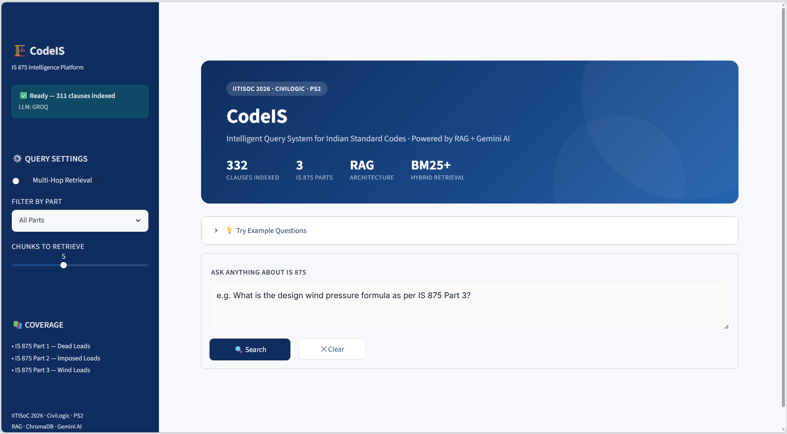

# CodeIS

**Intelligent Query System for Indian Standard Codes using Retrieval-Augmented Generation (RAG)**

CodeIS is an AI-powered question-answering system built for engineers, students, researchers, and professionals who need to quickly retrieve and understand information from **IS 875** (Indian Standard Code for Design Loads). Instead of manually searching hundreds of pages of standards, users ask natural language questions and get precise, clause-cited answers in seconds.

Developed as part of **IITISoC 2026** at **IIT Indore**.

## Dashboard


---

## Features

- Natural language querying of IS 875
- Hybrid retrieval (BM25 + dense vector search)
- Retrieval-Augmented Generation (RAG) pipeline
- Gemini / Groq LLM support
- Clause-level source citations
- Confidence scoring on answers
- FastAPI backend with a Streamlit dashboard
- Query history and source verification panel
- Multi-hop retrieval across multiple IS 875 parts

---

## Supported Standards

| Part          | Title         |
| ------------- | ------------- |
| IS 875 Part 1 | Dead Loads    |
| IS 875 Part 2 | Imposed Loads |
| IS 875 Part 3 | Wind Loads    |

---

## Architecture

```
                      User
                        │
                        ▼
              Streamlit Frontend
                        │
                        ▼
                 FastAPI Backend
                        │
           ┌────────────┴────────────┐
           │                         │
           ▼                         ▼
    Hybrid Retriever            LLM (Gemini/Groq)
   (BM25 + ChromaDB)                 │
           │                         │
           └────────────┬────────────┘
                        ▼
                 Final Response
                        │
                        ▼
          Answer + Clause Citations + Confidence
```

### Retrieval pipeline

```
User Question → Embedding → Hybrid Retrieval (BM25 + ChromaDB)
              → Top-K Relevant Chunks → Prompt Construction
              → Gemini / Groq → Final Answer → Citations + Sources
```

---

## Project Structure

```
CodeIS/
├── app.py                 # Streamlit frontend
├── api.py                 # FastAPI backend
├── config.py
├── requirements.txt
├── .env.example
│
├── generation/
│   ├── llm_client.py
│   ├── prompts.py
│   └── rag_engine.py
│
├── ingestion/
│   ├── chunker.py
│   ├── embedder.py
│   ├── pdf_parser.py
│   ├── pipeline.py
│   └── vector_store.py
│
├── retrieval/
│   ├── bm25_retriever.py
│   └── hybrid_retriever.py
│
├── evaluation/
├── utils/
│
├── data/
│   ├── is875/
│   ├── vectordb/
│   ├── bm25_index.pkl
│   └── qa_pairs/
│
└── .streamlit/
```

---

## Tech Stack

| Layer      | Technology              |
| ---------- | ----------------------- |
| Frontend   | Streamlit               |
| Backend    | FastAPI, Uvicorn        |
| AI / LLM   | Google Gemini, Groq     |
| Embeddings | Sentence Transformers   |
| Retrieval  | ChromaDB, BM25 (hybrid) |
| Language   | Python                  |

---

## Getting Started

### 1. Clone the repository

```bash
git clone https://github.com/YOUR_USERNAME/CodeIS.git
cd CodeIS
```

### 2. Create a virtual environment

```bash
python -m venv venv
```

Activate it:

```bash
# Windows
venv\Scripts\activate

# Linux / macOS
source venv/bin/activate
```

### 3. Install dependencies

```bash
pip install -r requirements.txt
```

### 4. Configure environment variables

Copy `.env.example` to `.env` and fill in your API key(s):

```bash
cp .env.example .env
```

### 5. Run the backend

```bash
python api.py
```

Backend runs at `http://localhost:8000`

### 6. Run the frontend

```bash
streamlit run app.py
```

Frontend runs at `http://localhost:8501`

---

## Example Questions

- What is the unit weight of reinforced cement concrete?
- What is the basic wind speed for Delhi?
- Explain imposed loads for residential bedrooms.
- What is the wind pressure formula?
- Explain Clause 7.3.3.13.

---

## Performance Notes

- Hybrid retrieval combining sparse (BM25) and dense (vector) search
- Top-K context retrieval with clause-level citations
- Built-in confidence estimation and source verification
- Typical response time: **1–4 seconds**

---

## Roadmap

- [ ] Support for additional IS Codes beyond IS 875
- [ ] PDF upload for custom documents
- [ ] OCR improvements for scanned standards
- [ ] Voice query support
- [ ] Multi-document retrieval
- [ ] Improved citation ranking and confidence estimation

---

## Contributors

Team: Himanshu, Shatakshi, Krishna , Abhijeet

IIT Indore — IITISoC 2026
